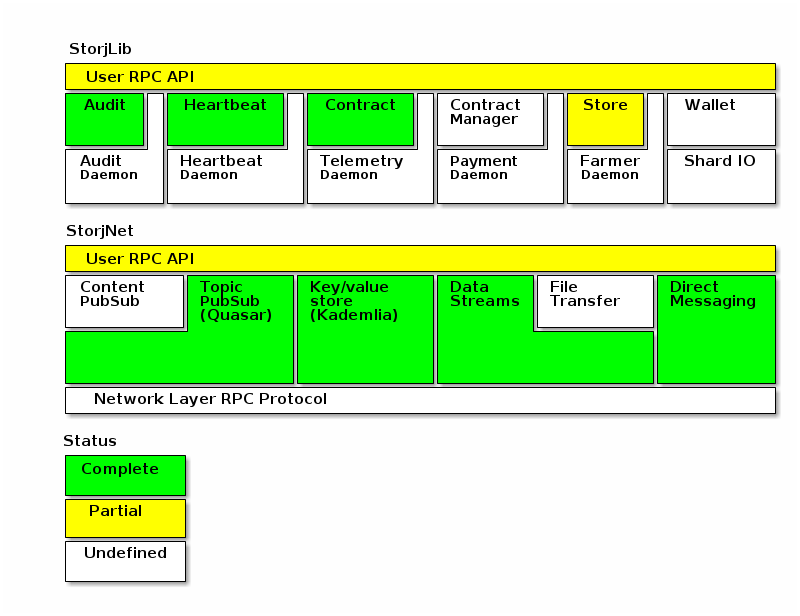

# Storj specification and compatibility tests

This repository contains the specification and compatibility tests for the 
storj application. It consists of three main components:

 * [storjnet](storjnet): Responsible node networking and communication.

 * [storjlib](storjlib): Responsible for storage contracts, auditing and heartbeat terms.

### Storj module stack

### Dependency graph and progress status

### Running compatibility tests

    # set location of rpc services (values listed are the expcted defaults)
    export STORJLIB_RPC_URL="http://127.0.0.1:7000"
    export STORJNET_SWARMSIZE="50"
    export STORJNET_USER_HOST="127.0.0.1"
    export STORJNET_USER_START_PORT="5000"

    # only run storjnet tests
    make test_storjnet

    # only run storjlib tests
    make test_storjlib

### Adding compatibility tests to travis

You can easily add compatibility tests to your travis build. Note you will
have to ensure a rpc service exposing the api is running for the tests.

#### Run storjnet compatibility tests

    env:
      - STORJNET_SWARMSIZE="50" STORJNET_USER_HOST="127.0.0.1" STORJNET_USER_START_PORT="5000"

    script:
      - bash -c "source <(curl -s https://raw.githubusercontent.com/Storj/storjspec/master/test_storjnet_compatibility.sh)"

#### Run storjlib compatibility tests

    env:
      - STORJLIB_RPC_URL="http://127.0.0.1:7000"

    script:
      - bash -c "source <(curl -s https://raw.githubusercontent.com/Storj/storjspec/master/test_storjlib_compatibility.sh)"
