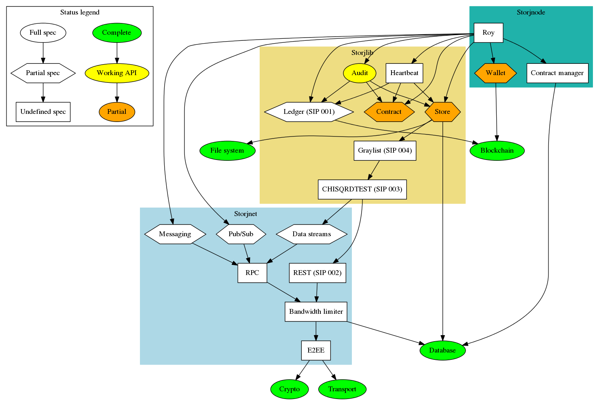

# Storj specification and compatibility tests

This repository contains the specification and compatibility tests for the 
storj application. It consists of three main components:

 * [storjnet](storjnet): Responsible node networking and communication.

 * [storjterms](storjterms): Responsible for storage contracts, auditing and heartbeat terms.

 * [storjnode](storjnode): Reference client that is not part of the protocol, but included as defines useful components required by most implementations.

### Dependency graph and progress status

### Running compatibility tests

    # set location rpc services (values listed are the expcted defaults)
    export STORJNET_RPC_URL="http://127.0.0.1:5000"
    export STORJNODE_RPC_URL="http://127.0.0.1:6000"
    export STORJTERMS_RPC_URL="http://127.0.0.1:7000"

    # run all tests
    make test

    # only run storjnet tests
    make test_storjnet

    # only run storjnode tests
    make test_storjnode

    # only run storjterms tests
    make test_storjterms

### Adding compatibility tests to travis

TODO implement, test and document

