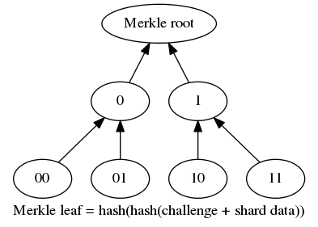

# Storage audit

The farmer provides proof of storage by hashing a given challenge with the
shard data. The correctness of the audit response can be verified via
a Merkle tree, which is given by the renter on shard transfer and the root
stored in the contract. 

## Generating audit challenges

TODO describe

## Generating the Merkle tree

TODO describe

## Preforming the audit response

TODO describe

## Verification of the audit with the Merkle tree

TODO describe

Merkle leaf = hash(hash(challenge + shard data))
Padded leaf = hash("")

