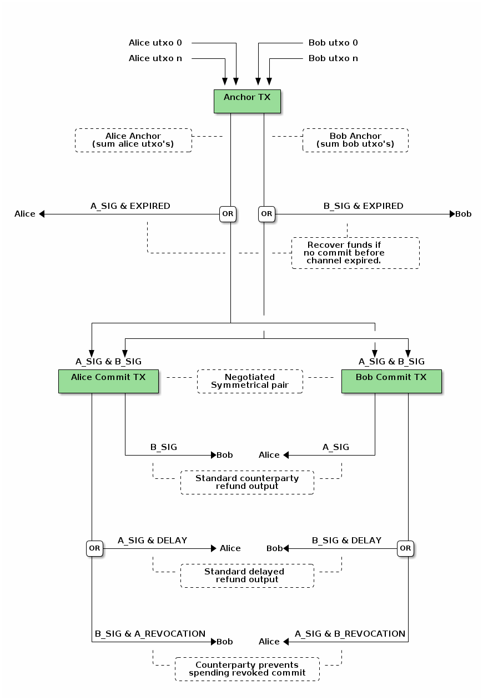

# Simple bidirectional trustless micropayent channels.

This is based on the worked previously done by the lightning network
developers. It is a simplified, less feature rich and should still meet all
our needs.

For more information on the underlying mechinisms see:

 * [BIP112](https://github.com/bitcoin/bips/blob/master/bip-0112.mediawiki#Motivation)
 * [BIP68](https://github.com/bitcoin/bips/blob/master/bip-0068.mediawiki)
 * [Deployable Lightning](https://github.com/ElementsProject/lightning/blob/master/doc/deployable-lightning.pdf)
 * [Lightning Network](https://lightning.network/lightning-network-paper.pdf)

## Bidirectional trustless micropayent channels

## Scripts

Scripts currently untested and most likely contain bugs!

### Anchor output script

    IF
        2 <OWNER_PUBKEY> <COUNTERPARTY_PUBKEY> 2 OP_CHECKMULTISIGVERIFY
    ELSE
        <EXPIRE_TIME> OP_CHECKSEQUENCEVERIFY OP_DROP
        <RECOVER_PUBKEY> OP_CHECKSIGVERIFY
    ENDIF

### Commit counterparty output

    <OWNER_PUBKEY> OP_CHECKSIG

### Commit owner output script

    IF
        <DELAY> OP_CHECKSEQUENCEVERIFY OP_DROP <OWNER_PUBKEY> OP_CHECKSIG
    ELSE
        TODO revocation
    ENDIF
